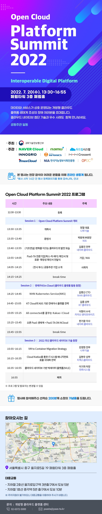

Open Cloud Platform Summit 2022
=
#### ■ 일자: 2022.07.20
#### ■ 방식 : 온/오프라인(유투브 생중계)
#### ■ 주최 : 과학기술정보통신부
#### ■ 주관: NAVER Cloud, 나무기술, 두드림시스템, INNOGRID, INFRANICS, NHN Crossent, TmaxCloud, 한국지능정보사회진흥원, OPDC
#### ■ 참석대상 : 중앙 및 지자체, 공공기관 등 정보화사업 담당자
#### ■ 주요내용 : 클라우드 네이티브 기반 빅데이터 플랫폼(NILE) 서밋 발표

#### ■ 참고 URL: https://paas-ta.kr/notice/noticeView/1074?query=&query_type=all&query_type1=all&start=1