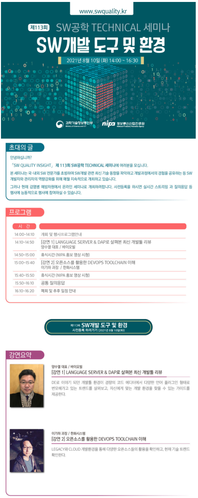

### 113차 SW공학 TECHNICAL 기술세미나 (2021.08.10)
    안녕하세요?
    [SW QUALITY INSIGHT] 제113회 SW공학 TECHNICAL 세미나에 여러분을 모십니다.

    본 세미나는 국/내외 SW전문가를 초빙하여 SW개발 관련 최신 기술 동향을 파악하고
    개발과정에서의 경험을 공유하는 등 SW개발자와 관리자의 역량강화를 위해 매월 지속적으로 개최하고 있습니다.

    그러나 현재 감염병 예방차원에서 온라인 세미나로 개최하려합니다. 사전등록을 하시면 실시간 스트리밍과
    질의응답 등 행사에 능록적으로 행사에 참여하실 수 있습니다.

#### <강연2>
#### ■ 주제 : 오픈소스를 활용한 DevOps Toolchain이해
#### ■ 내용 : Legacy와 Cloud 개발환경을 통해 다양한 오픈소스들의 활용을 확인하고, 현재 기술 트렌트를 확인한다.

#### ■ 일시: 2021.8.10(화) 14:00 ~ 16:20

#### ■ 참고 URL: https://swquality.kr/index#%EC%A0%9C113%ED%9A%8C-SW%EA%B0%9C%EB%B0%9C-%EB%8F%84%EA%B5%AC-%EB%B0%8F-%ED%99%98%EA%B2%BD