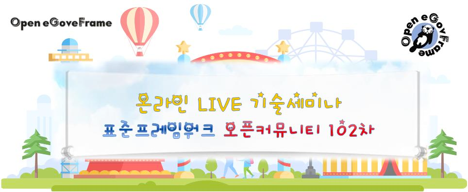
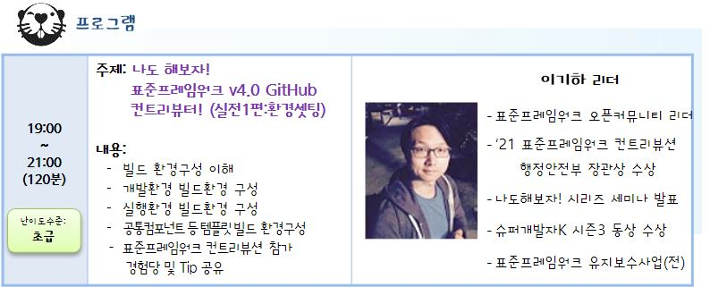

### 91차 세미나(2020.12.01)-나도 해보자! Hands-on Cloud on eGov-Framework
이번 세미나는 <2022 전자정부 표준프레임워크 컨트리뷰션(03.28~07.31)>  참여를 통해
오픈소스 문화에 동참하고 표준프레임워크 컨트리뷰터가 되기 위한 첫 단계를 준비하실 수 있도록
나도 해보자! 표준프레임워크 v4.0 GitHub 컨트리뷰터! (실전1편:환경셋팅) 으로 준비했습니다!

나도 해보자! 시리즈의 주인공 이기하 리더님과
전자정부 표준프레임워크 v4.0 컨트리뷰션을 위한 환경을 구성하는 시간을 가져보아요!
이번엔 꼭 컨트리뷰션에 참여해야지! 했던 분들은 이번 세미나 놓.치.지 마.세.요^^

또한 지난번 세미나 설문에서 컨트리뷰션 실제 사례를 듣고 싶다고 하셔서,
이기하 리더님께서 컨트리뷰션하신 내용 공유해 주시고 Tip 도 알려주시는 시간도 준비했습니다!

관심 있는 분들의 많은 참여 부탁드립니다.

#### ■ 주제: 나도 해보자! 표준프레임워크 v4.0 GitHub 컨트리뷰터! (실전1편:환경셋팅)
#### ■ 일시: 2022. 05. 11(수), 19:00 ~ 21:00 (120분)
#### ■ 장소: 인터넷이 되는 곳이면 어디서나!
#### ■ 주관: 표준프레임워크 오픈커뮤니티
#### ■ 대상: 관심 있는 분 누구나!!
#### ■ 내용 : 
-  빌드 환경구성 이해
-  개발환경 빌드환경 구성
-  실행환경 빌드환경 구성
-  공통컴포넌트 등 템플릿 빌드 환경구성
-  표준프레임워크 컨트리뷰션 참가 경험담 및 Tip 공유

#### ■ 참고 URL: https://open.egovframe.org/oc/products/seminarItem.do?nttId=20059