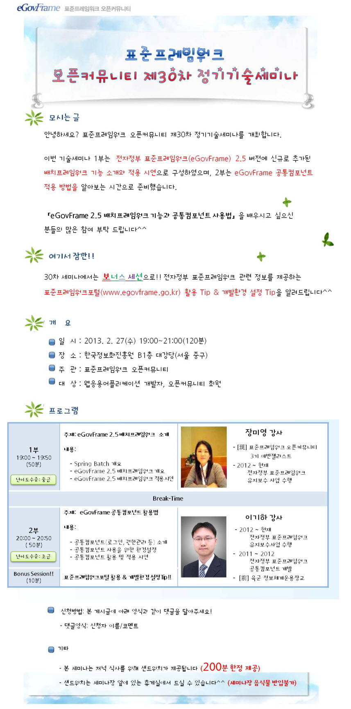
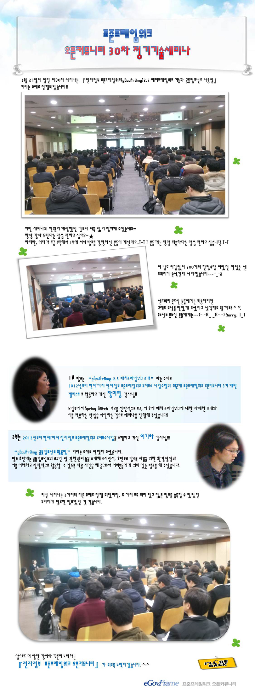

### 30차 기술세미나 (2013.02.27)- eGovFrame 2.5 배치프레임워크 기능과 공통컴포넌트 사용법 소개
    안녕하세요? 표준프레임워크 오픈커뮤니티 제30차 정기기술세미나를 개최합니다.
    
    이번 기술세미나 1부는  전자정부 표준프레임워크(eGovFrame) 2.5 버전에 신규로 추가된
    배치프레임워크 기능 소개와 적용 시연으로 구성하였으며, 2부는 eGovFrame 공통컴포넌트
    적용 방법을 알아보는 시간으로 준비했습니다.
    
    『eGovFrame 2.5 배치프레임워크 기능과 공통컴포넌트 사용법』을 배우시고 싶으신 분들의
    많은 참여 부탁 드립니다^^
    
    여기서 잠깐!!!
    30차 세미나에서는 보너스 세션으로!! 전자정부 표준프레임워크 관련 정보를 제공하는
    표준프레임워크포털(www.egovframe.go.kr) 활용 Tip & 개발환경 설정 Tip을 알려드립니다^^

#### <1부> 생

#### <2부>
#### ■ 주제 : eGovFrame 공통컴포넌트 활용법
#### ■ 내용 :
- 공통컴포넌트(로그인, 권한관리 등) 소개
- 공통컴포넌트 사용을 위한 환경설정
- 공통컴포넌트 활용 및 적용 시연

#### ■ 난이도 수준: 초급
#### ■ 발표자 소개 : 이기하 강사
- 2012 ~ 현재 전자정부 표준프레임워크 유지보수사업 수행
- 2011 ~ 2012 전자정부 표준프레임워크 공통컴포넌트 개발
- [前] 육군 정보체계운용장교

#### ■ 일시: 2013.2.27(수) 19:00 ~ 21:00 (120분)
#### ■ 장소: 한국정보화진흥원 무교동청사 지하1층 대강당 (서울 중구)
#### ■ 대상: 웹응용어플리케이션 개발자, 오픈커뮤니티 회원

#### ■ 참고 URL: https://open.egovframe.org/oc/products/seminarItem.do?nttId=6099&pageIndex=12