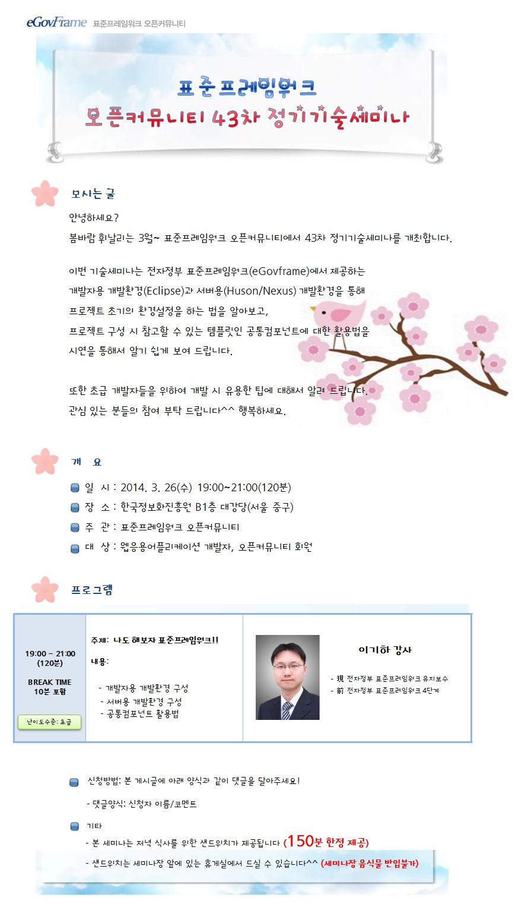
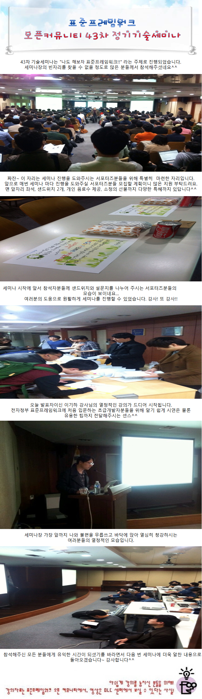

### 43차 기술세미나 (2014.03.26) - 나도 해보자 표준프레임워크!!
    안녕하세요?
    봄바람 휘날리는 3월~ 표준프레임워크 오픈커뮤니티에서 43차 정기기술세미나를 개최합니다.
    
    이번 기술세미나는 전자정부 표준프레임워크(eGovframe)에서 제공하는
    개발자용 개발환경(Eclipse)과 서버용(Huson/Nexus) 개발환경을 통해
    프로젝트 초기의 환경설정을 하는 법을 알아보고,
    프로젝트 구성 시 참고할 수 있는 템플릿인 공통컴포넌트에 대한 활용법을
    시연을 통해서 알기 쉽게 보여 드립니다.
    
    또한, 초급 개발자들을 위하여 개발 시 유용한 팁에 대해서 알려 드립니다.
    관심 있는 분들의 참여 부탁 드립니다^^ 행복하세요.
    
#### ■ 주제 : 나도 해보자 표준프레임워크!!
#### ■ 내용 :
- 개발자용 개발환경 구성
- 서버용 개발환경 구성
- 공통컴포넌트 활용법
#### ■ 난이도 수준: 초급
#### ■ 발표자 소개 : 이기하 강사
- 現 전자정부 표준프레임워크 유지보수
- 前 전자정부 표준프레임워크 4단계
#### ■ 일시: 2014.3.26(수) 19:00 ~ 21:00 (120분)
#### ■ 장소: 한국정보화진흥원 무교동청사 지하1층 대강당 (서울 중구)
#### ■ 대상: 웹응용어플리케이션 개발자, 오픈커뮤니티 회원
    

    
#### ■ 참고 URL: https://open.egovframe.org/oc/products/seminarItem.do?nttId=11471&pageIndex=9