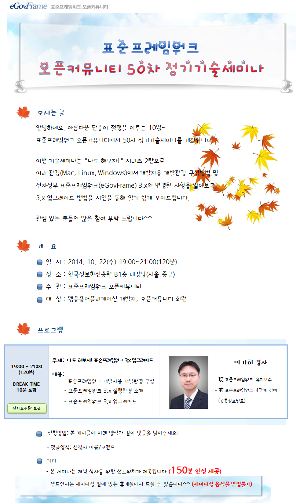
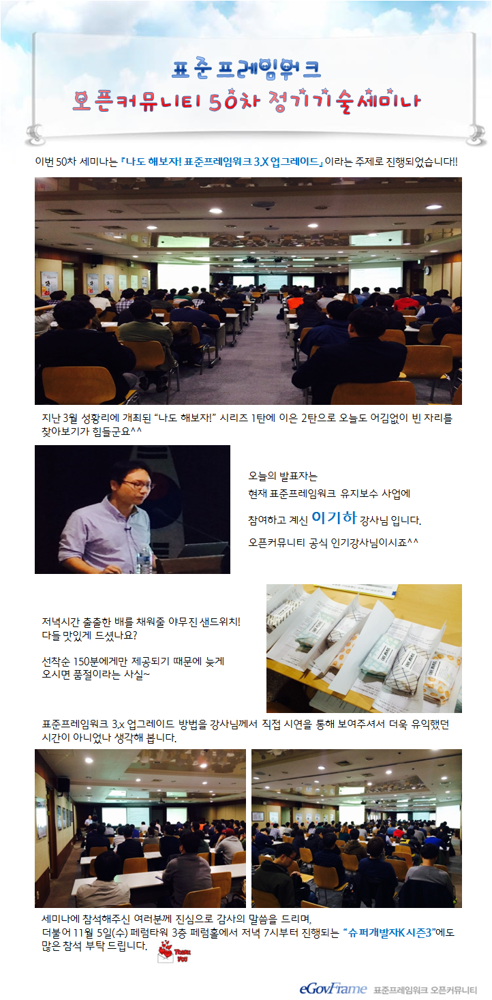

### 50차 기술세미나 (2014.10.22) - 나도 해보자! 표준프레임워크 3.X 업그레이드
    안녕하세요.
    아름다운 단풍이 절정을 이루는 10월~
    표준프레임워크 오픈커뮤니티에서 50차 정기기술세미나를 개최합니다.
    
    이번 기술세미나는 "나도 해보자!" 시리즈 2탄으로
    여러 환경(Mac, Linux, Windows)에서 개발자용 개발환경 구성방법 및
    전자정부 표준프레임워크(eGovFrame) 3.x의 변경된 사항을 알아보고,
    3.x 업그레이드 방법을 시연을 통해 알기 쉽게 보여드립니다.
    
    관심 있는 분들의 많은 참여 부탁 드립니다^^
    
#### ■ 주제 : 나도 해보자! 표준프레임워크 3.X 업그레이드
#### ■ 내용 :
- 표준프레임워크 개발자용 개발환경 구성
- 표준프레임워크 3.x 실행환경 소개
- 표준프레임워크 3.x 업그레이드
#### ■ 난이도 수준: 초급
#### ■ 발표자 소개 : 이기하 강사
- 現 표준프레임워크 유지보수
- 前 표준프레임워크 4단계 참여(공통컴포넌트)
#### ■ 일시: 2014.10.22(수) 19:00 ~ 21:00 (120분)
#### ■ 장소: 한국정보화진흥원 무교동청사 지하1층 대강당 (서울 중구)
#### ■ 대상: 웹응용어플리케이션 개발자, 오픈커뮤니티 회원
    

    
#### ■ 참고 URL: https://open.egovframe.org/oc/products/seminarItem.do?nttId=13274&pageIndex=8