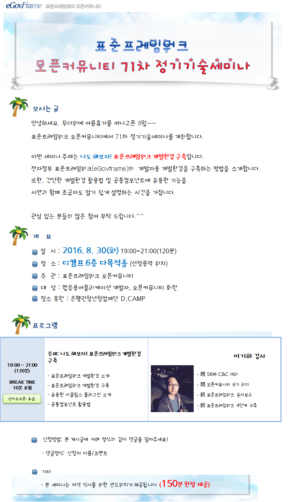

### 71차 기술세미나(2016.8.30) - 나도 해보자! 표준프레임워크 개발환경 구축
    안녕하세요. 무더위에 여름휴가를 떠나고픈 8월~~
    표준프레임워크 오픈커뮤니티에서 71차 정기기술세미나를 개최합니다.
    
    이번 세미나 주제는 나도 해보자! 표준프레임워크 개발환경 구축입니다.
    전자정부 표준프레임워크(eGovframe)의 개발자용 개발환경을 구축하는 방법을 소개합니다.
    또한, 간단한 개발환경 활용법 및 공통컴포넌트에 유용한 기능을
    시연과 함께 초급자도 알기 쉽게 설명하는 시간을 가집니다.
    
    관심 있는 분들의 많은 참여 부탁 드립니다.^^
    
#### ■ 주제 : 나도 해보자! 표준프레임워크 개발환경 구축
#### ■ 내용 :  
- 표준프레임워크 개발환경 소개
- 표준프레임워크 개발환경 구축
- 유용한 이클립스 플러그인 소개
- 공통컴포넌트 활용법
#### ■ 난이도 수준: 초급
#### ■ 발표자 소개: 이기하 강사
- 現 SK㈜ C&C 대리    
- 現 오픈커뮤니티 6기 리더
- 前 표준프레임워크 유지보수
- 前 표준프레임워크 4단계 구축
#### ■ 일시: 2016. 8. 30(화) 19:00~21:00(120분)
#### ■ 장소: 디캠프 6층 다목적홀 (선정릉역 위치)
#### ■ 대상: 웹응용어플리케이션 개발자, 오픈커뮤니티 회원
#### ■ 장소 후원 : 은행권청년창업재단 D.CAMP
    

    
#### ■ 참고 URL: https://open.egovframe.org/oc/products/seminarItem.do?nttId=18387&pageIndex=4