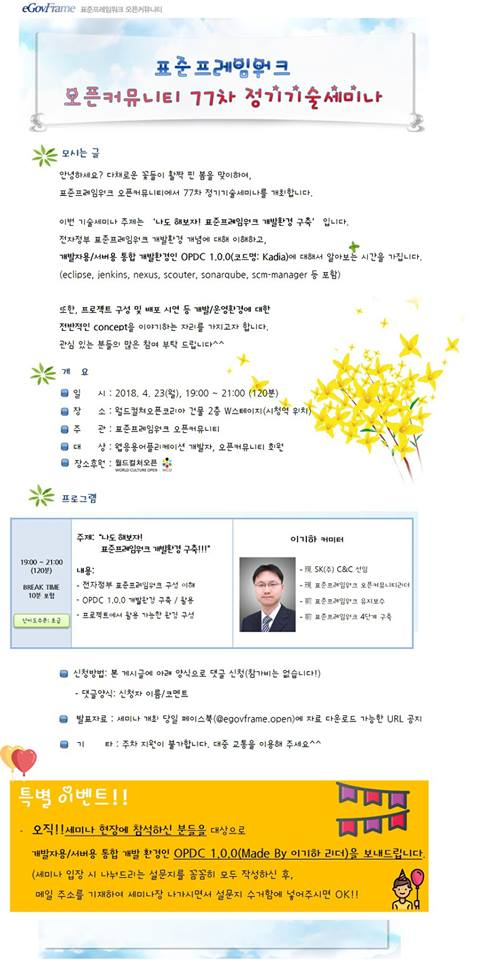
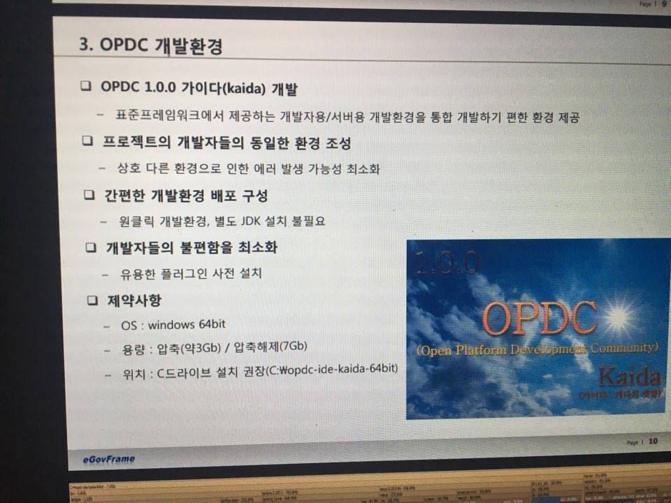
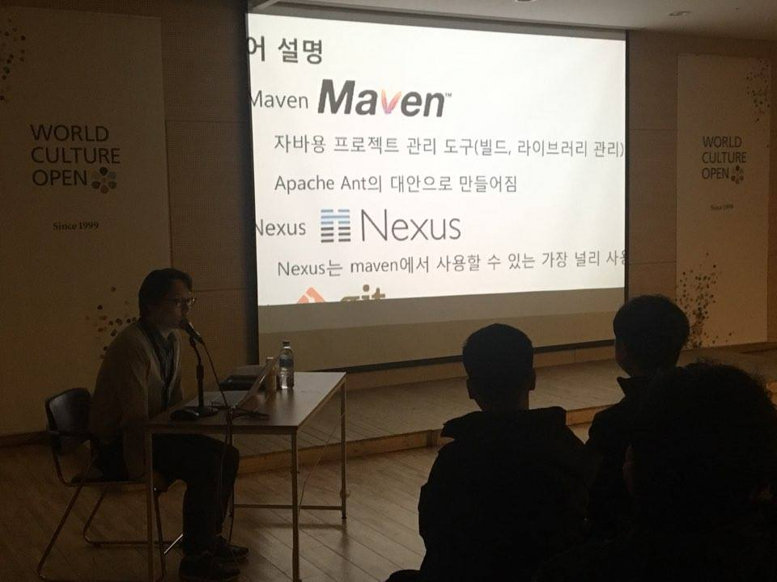
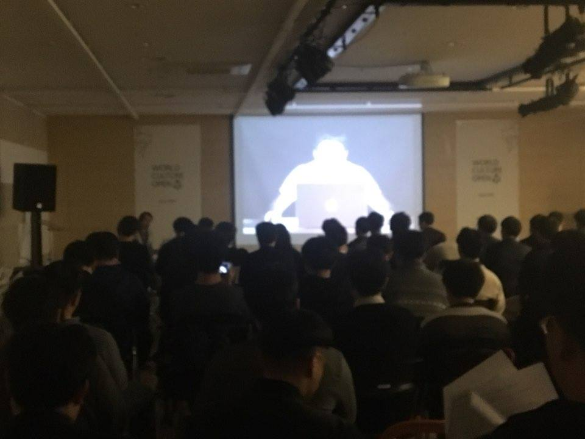
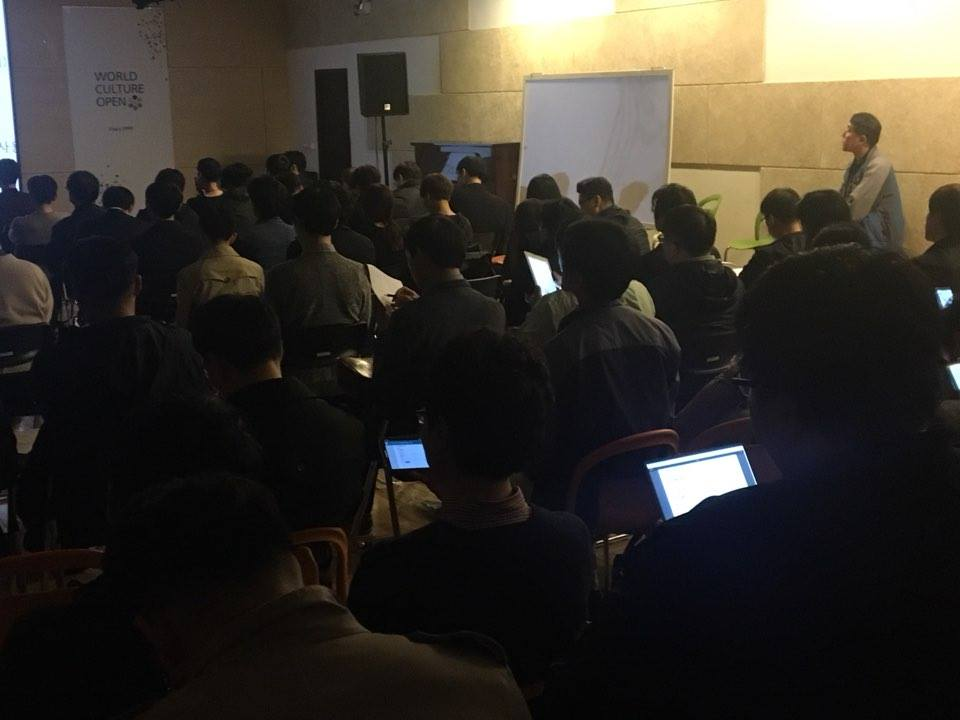

### 77차 기술세미나(2018.04.23) - 나도 해보자! 표준프레임워크 개발환경 구축
    안녕하세요? 다채로운 꽃들이 활짝 핀 봄을 맞이하여,
    표준프레임워크 오픈커뮤니티에서 77차 정기기술세미나를 
    개최합니다.
    
    이번 기술세미나 주제는
    "나도 해보자! 표준프레임워크 개발환경 구축" 입니다.
    
    전자정부 표준프레임워크 개발환경 개념에 대해 이해하고,
    개발자용/서버용 통합 개발환경인 OPDC 1.0.0(코드명: Kadia)에 대해서 알아보는 시간을 가집니다.(eclipse, jenkins, nexus, scouter, sonarqube, scm-manager 등 포함)
    
    또한, 프로젝트 구성 및 배포 시연 등 개발/운영환경에 대한
    전반적인 concept을 이야기하는 자리를 가지고자 합니다.
    관심 있는 분들의 많은 참여 부탁 드립니다^^
    
#### ■ 주제 : 나도 해보자! 표준프레임워크 개발환경 구축
#### ■ 일시 : 2018.04.23(월) 19:00~21:00
#### ■ 장소 : 월드컬쳐오픈코리아 건물 2층 W스테이지(시청역 위치)
#### ■ 내용 :
- 표준프레임워크 구성 이해
- OPDC 1.0.0 개발환경 구축 / 활용
- 프로젝트에서 활용가능한 환경 구성
#### ■ 난이도 수준: 초급
#### ■ 발표자 소개: 이기하 리더
- 現 SK(주) C&C 선임
- 現 표준프레임워크 오픈커뮤니티 리더
- 前 표준프레임워크 유지보수
- 前 표준프레임워크 4단계 구축

    

#### ■ 참고 URL: https://open.egovframe.org/oc/products/seminarItem.do?nttId=19798&pageIndex=3