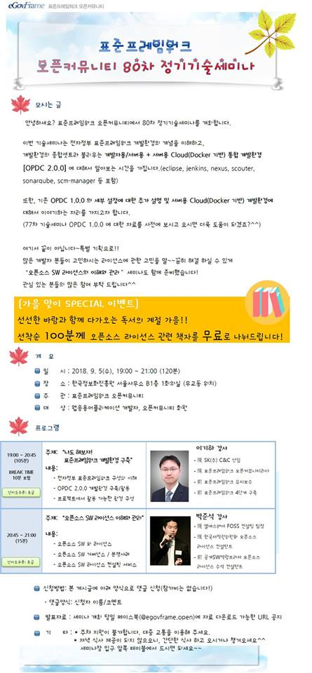
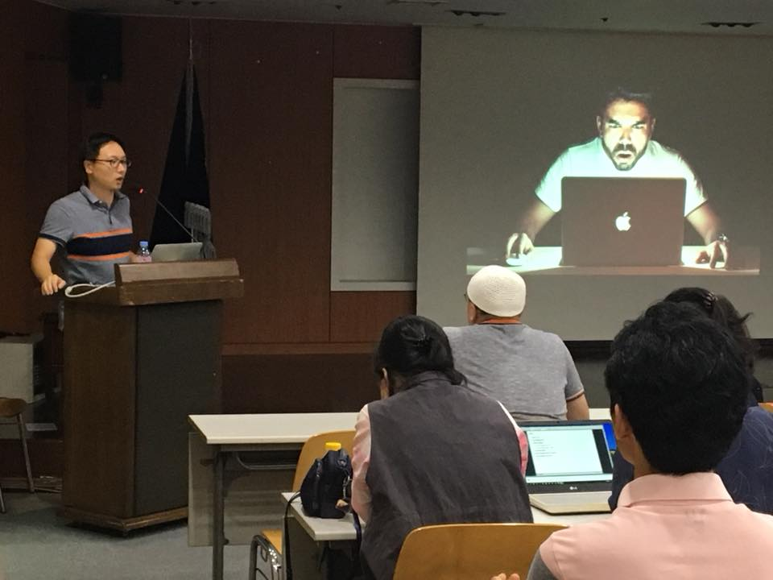
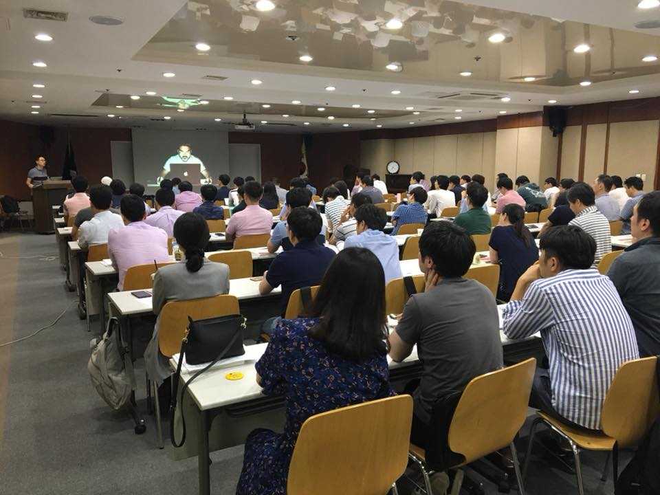

### 80차 기술세미나(2018.09.05) - 나도 해보자! 표준프레임워크 개발환경 구축!!  & 오픈소스 라이선스 이해와 관리
    안녕하세요? 
    다가올 가을을 맞이하여 80차 기술세미나를 개최합니다.
    
    이번 기술세미나는 
    전자정부 표준프레임워크 개발환경 개념을 이해하고, 
    개발환경의 종합셋트라 불리우는 개발자용/서버용 + 서버용 Cloud(Docker 기반) 통합 개발환경 [OPDC 2.0.0] 에 대해서 알아보는 시간을 가집니다.(eclipse, jenkins, nexus, scouter, sonarqube, scm-manager 등 포함)
    
    또한, 기존 OPDC 1.0.0 의 세부설정에 대한 추가 설명 및 서버용 Cloud(Docker 기반) 개발환경에 대해서 이야기하는 자리를 가지고자 합니다.
    (77차 기술세미나 OPDC 1.0.0에 대한 자료를 사전에 보시고 오시면 더욱 도움이 되겠죠?^^)
    
    여기서 끝이 아닙니다~~특별 기획으로!! 
    많은 개발자 분들이 고민하시는 라이선스에 관한 고민을
    말끔히 해결 하실 수 있게 [오픈소스 SW 라이선스의 이해와 관리]세미나도 함께 준비했습니다!
    
    관심 있는 분들의 많은 참여 부탁드립니다^^
    ------------------------------------------------------------------------------
    [가을 맞이 SPECIAL 이벤트]
    선선한 바람과 함께 다가오는 독서의 계절 가을!! 선착순 100분께 오픈소스 라이선스 관련 책자를 무료로 나눠드립니다! 
    ------------------------------------------------------------------------------
    
#### ■ 주제 : 나도 해보자! 표준프레임워크 개발환경 구축!! & 오픈소스 라이선스 이해와 관리
#### ■ 일시 : 2018.09.05(수) 19:00~21:00
#### ■ 장소 : 한국정보화진흥원서울청사 B1회의실(무교동위치)
#### ■ 내용 :
- 1부: 나도 해보자! 표준프레임워크 개발환경 구축]
- 전자정부 표준프레임워크 구성의 이해
- OPDC 2.0.0 개발환경 구축/활용
- 프로젝트에서 활용 가능한 환경 구성
#### ■ 난이도 수준: 초급
#### ■ 발표자 소개:
    [1부: 이기하 강사]
- 現 SK(주) C&C 선임
- 現 표준프레임워크 오픈커뮤니티리더
- 前 표준프레임워크 유지보수
- 前 표준프레임워크 4단계 구축

    

#### ■ 참고 URL: https://open.egovframe.org/oc/products/seminarItem.do?nttId=19807&pageIndex=2