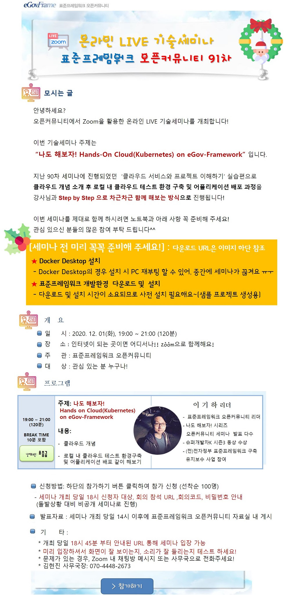

### 91차 세미나(2020.12.01)-나도 해보자! Hands-on Cloud on eGov-Framework
안녕하세요?   
오픈커뮤니티에서 Zoom을 활용한 온라인 LIVE 기술세미나를 개최합니다!

이번 기술세미나 주제는   
나도 해보자! Hands-On Cloud(Kubernetes) on eGov-Framework 입니다.

지난 90차 세미나에 진행되었던  <클라우드 서비스와 프로젝트 이해하기 실습편>으로   
클라우드 개념 소개 후 로컬 내 클라우드 테스트 환경 구축 및 어플리케이션 배포 과정을   
강사님과 Step by Step 으로 차근차근 함께 해보는 방식으로 진행됩니다!

이번 세미나를 제대로 함께 하시려면 노트북과 아래 사항 꼭 준비해 주세요!   
관심 있으신 분들의 많은 참여 부탁 드립니다^^

#### ■ 주제: 나도 해보자! Hands-on Cloud on eGov-Framework
#### ■ 일시: 2020. 12. 01(화), 19:00 ~ 21:00 (120분: 쉬는시간 10분 포함)
#### ■ 장소: 인터넷이 되는 곳이면 어디서나!
#### ■ 주관: 표준프레임워크 오픈커뮤니티
#### ■ 대상: 관심 있는 분 누구나!!
#### ■ 내용 : 
- 클라우드 개념
- 로컬 내 클라우드 테스트 환경구축 및 어플리케이션 배포 같이 해보기
#### ■ 난이도 수준: 초급
#### ■ 발표자 소개: 이기하 리더
- 표준프레임워크 오픈커뮤니티 리더
- 나도 해보자! 시리즈  오픈커뮤니티 세미나  발표
- 슈퍼개발자K 시즌3 동상 수상
- (전)전자정부 표준프레임워크 구축유지보수 사업 참여

#### ■ 참고 URL: https://open.egovframe.org/oc/products/seminarItem.do?nttId=19932