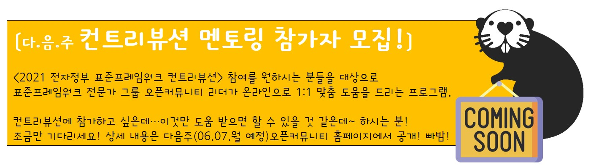
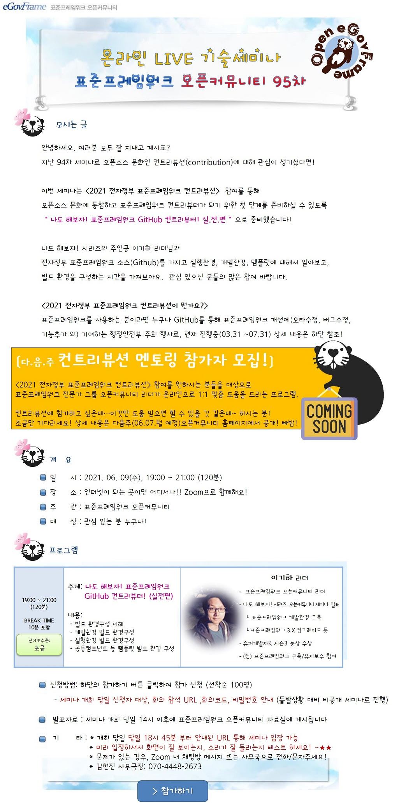

### 91차 세미나(2020.12.01)-나도 해보자! Hands-on Cloud on eGov-Framework
안녕하세요. 여러분 모두 잘 지내고 계시죠?
지난 94차 세미나로 오픈소스 문화인 컨트리뷰션(contribution)에 대해 관심이 생기셨다면!

이번 세미나는 <2021 전자정부 표준프레임워크 컨트리뷰션>  참여를 통해
오픈소스 문화에 동참하고 표준프레임워크 컨트리뷰터가 되기 위한 첫 단계를 준비하실 수 있도록
나도 해보자! 표준프레임워크 GitHub 컨트리뷰터! 실.전.편 으로 준비했습니다!

나도 해보자! 시리즈의 주인공 이기하 리더님과
전자정부 표준프레임워크 소스(Github)를 가지고 실행환경, 개발환경, 템플릿에 대해서 알아보고,
빌드 환경을 구성하는 시간을 가져보아요.  관심 있으신 분들의 많은 참여 바랍니다.

<2021 전자정부 표준프레임워크 컨트리뷰션이 뭔가요?>
표준프레임워크를 사용하는 분이라면 누구나 GitHub를 통해 표준프레임워크 개선에(오타수정, 버그수정, 기능추가 외) 기여하는
행정안전부 주최 행사로, 현재 진행중(03.31 ~07.31) 상세 내용은 하단 이미지 참조해 주세요!

#### ■ 주제: 나도 해보자! 표준프레임워크 GitHub 컨트리뷰터(실전편)
#### ■ 일시: 2021. 06. 09(수), 19:00 ~ 21:00 (120분: 쉬는시간 10분 포함)
#### ■ 장소: 인터넷이 되는 곳이면 어디서나!
#### ■ 주관: 표준프레임워크 오픈커뮤니티
#### ■ 대상: 관심 있는 분 누구나!!
#### ■ 내용 : 
- 빌드 환경구성 이해
- 개발환경 빌드 환경구성
- 실행환경 빌드 환경구성
- 공통컴포넌트 등 템플릿 빌드 환경 구성
#### ■ 난이도 수준: 초급
#### ■ 발표자 소개: 이기하 리더
- 표준프레임워크 오픈커뮤니티 리더
- 나도 해보자! 시리즈  오픈커뮤니티 세미나  발표
- 슈퍼개발자K 시즌3 동상 수상
- (전)전자정부 표준프레임워크 구축유지보수 사업 참여

#### ■ 참고 URL: https://open.egovframe.org/oc/products/seminarItem.do?nttId=19993