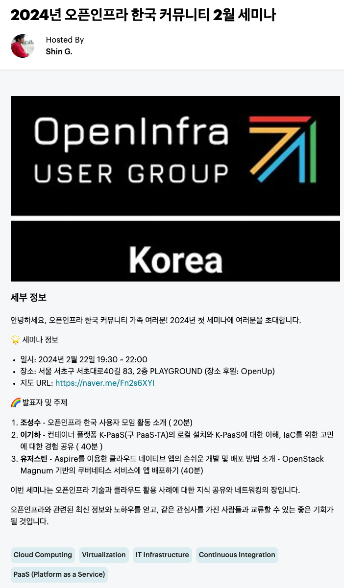

### 🎉 2024년 오픈인프라 한국 사용자그룹 첫 세미나 참가자 모집! 🎉

    🌈 발표자 및 주제
    컨테이너 플랫폼 K-PaaS(구 PaaS-TA)의 로컬 설치와 K-PaaS에 대한 이해, IaC를 위한 고민에 대한 경험 공유

#### **<Schedule**>
#### ■ 일시: 2024년 2월 22일 19:30 ~ 22:00
#### ■ 장소: 서울 서초구 서초대로40길 83, 2층 PLAYGROUND (장소 후원: OpenUp)

#### ■ 참고 URL: https://www.meetup.com/ko-KR/openstack-and-open-infrastructure-korea/events/298906178/
