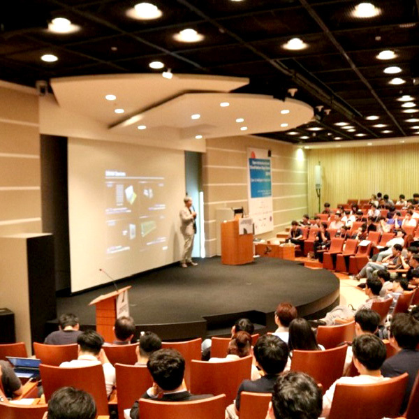

### OpenInfra Community Days Korea 2023 (2023.07.03)
    OpenInfra Community Days Korea 2023
    OpenInfra Community Days Korea는 한국의 오픈소스 인프라 기술과 클라우드 네이티브 기술 커뮤니티가 함께 만들어가는 기술 컨퍼런스입니다.
    본 컨퍼런스는 2014년부터 진행해온 오픈스택 한국 커뮤니티의 OpenStack Day 와 
    2018년부터 진행한 쿠버네티스 코리아 그룹의 Cloud Native Days 및 Kubernetes Community Days를 합쳐서 공동으로 진행합니다.
    
    2018년 OpenStack, OCP, Ceph, Kubernetes 커뮤니티가 처음으로 공동 컨퍼런스 “Open Infrastructure & Cloud Native Days Korea” 를 주최하였고,
    2022년 “OpenInfra & Cloud Native Days Korea”에 이어서,
    2023년에는 OpenInfra Community Days Korea라는 공통 주제로 오픈소스 인프라스트럭처 기술 전문가들을 위한 기술 교류의 장을 만들고자 합니다.
    
    1일차는 Kubernetes Community Days & OpenInfra, Ceph Day Korea 2023 라는 명칭으로
    Cloud Native, OpenInfra, Storage 기술 중심의 이야기를 다룹니다.
    
    2일차는 OCP APAC TechDay 2023 라는 명칭으로 Open Compute Project 기술 중심 세션이 편성되며
    Cloud Native, OpenInfra, Storage 기술 또한 함께 다뤄집니다.
    
    오픈소스 인프라 기술에 관심있는 모두가 2일간의 행사를 다양한 주제로 재미있게 즐길 수 있도록 발표 주제를 분산 배치할 예정입니다.

#### **<Schedule**>
#### ■ Track : track2
#### ■ Date: Day 1
#### ■ Time: 15:30 ~ 16:00
#### ■ Session detail
#### ■ kubernetes기반 keycloak, openldap를 활용한 openid 기반의 각종 app간의 인증/인가 경험담 공유

#### ■ 참고 URL: https://2023.openinfradays.kr/session/12